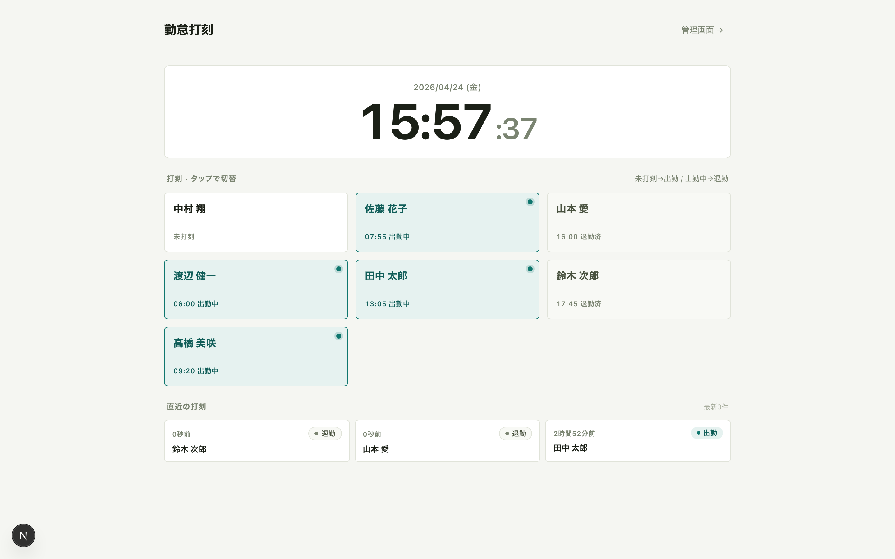
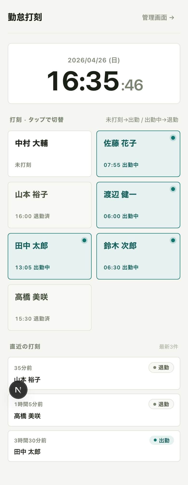
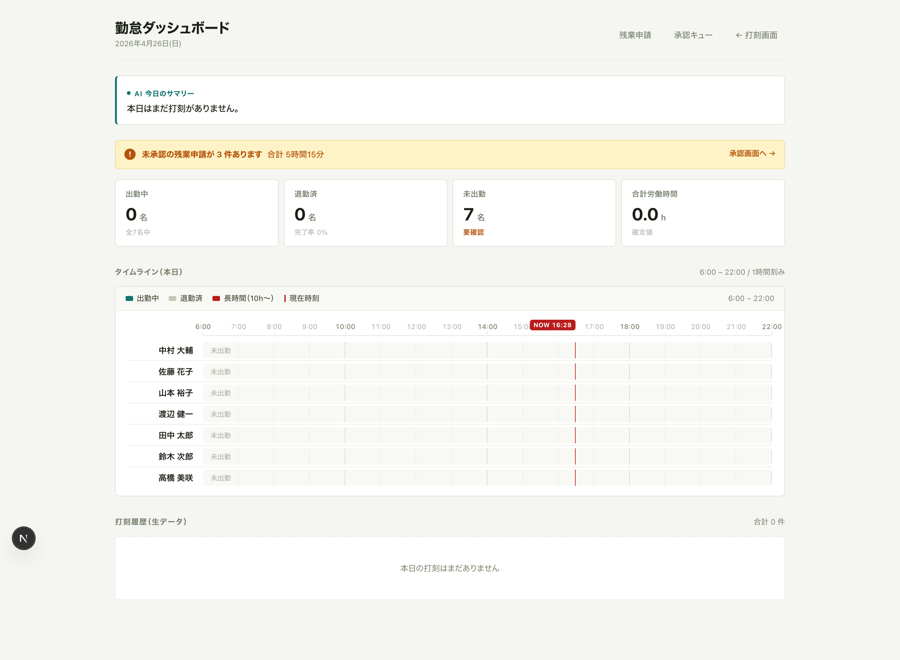
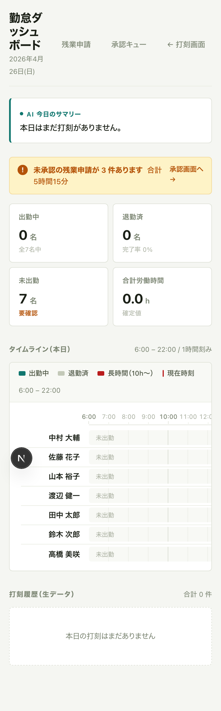
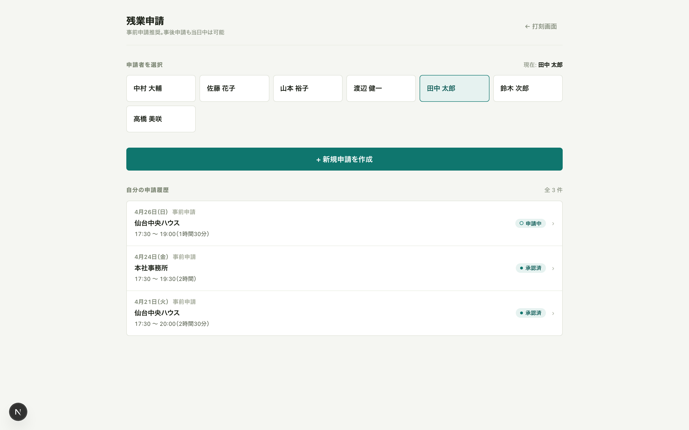
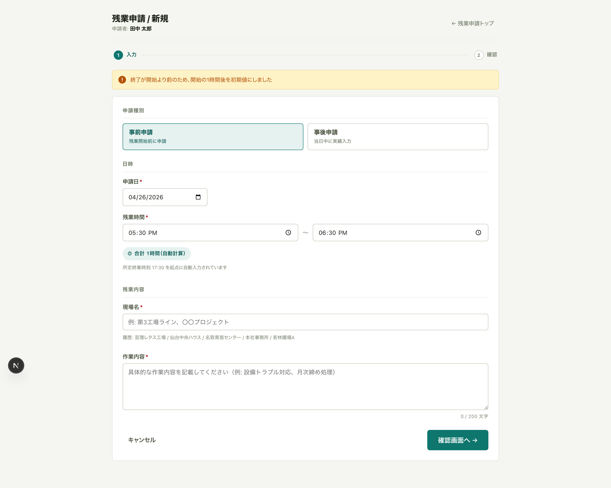
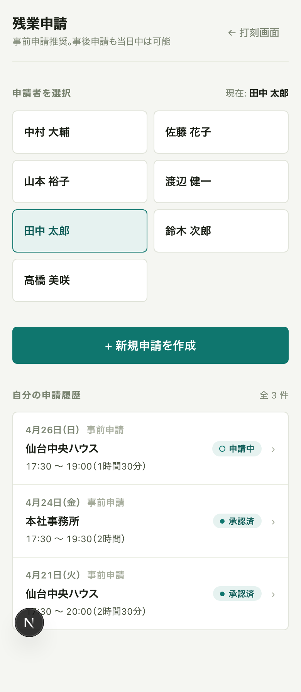
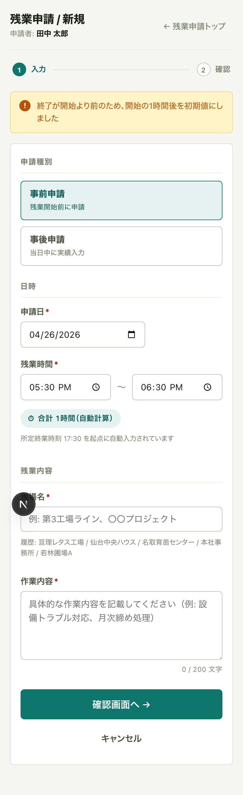
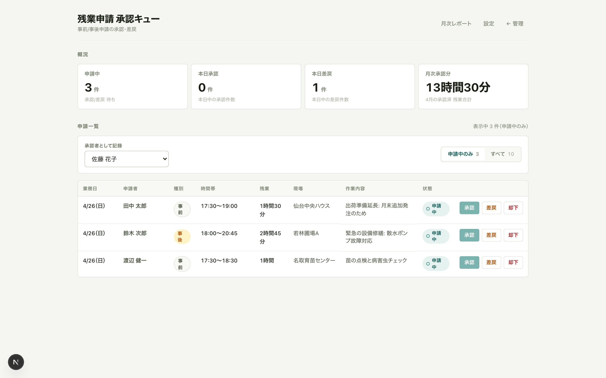
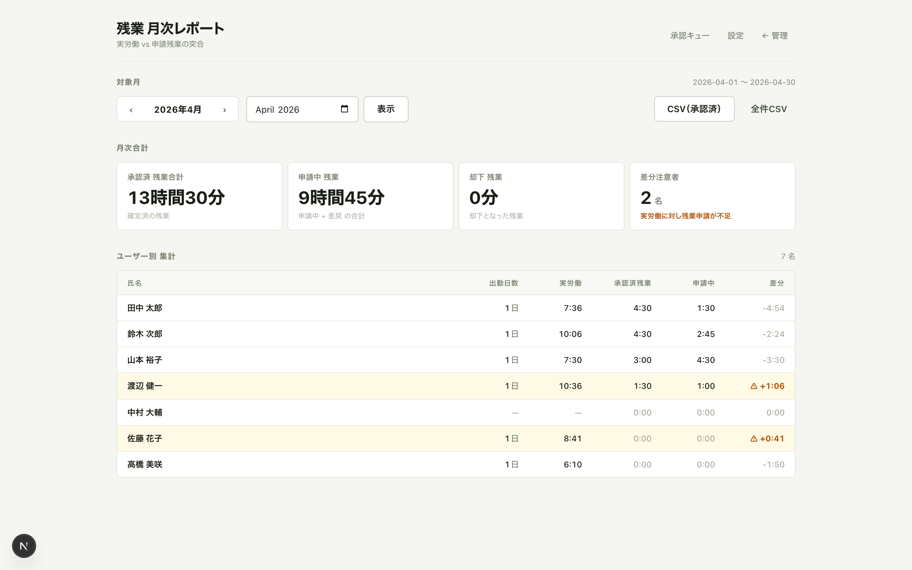

# 勤怠打刻アプリ — サービス概要

> **1タップで打刻、管理者は1画面で全員の勤怠をひと目で把握。**
> **残業申請も同じ画面の延長線上で完結**。
> 現場のタブレット運用を想定した、シンプルで速い勤怠システム（デモ版）

---

## 解決する課題

- **打刻の手間**: 紙タイムカード・Excel入力・既存勤怠SaaSのログイン手順は、現場作業員にとって負担が大きい
- **勤怠状況の把握の遅さ**: 「今誰が出勤中か」「長時間労働になっていないか」が月末まで分からない職場が多い
- **残業申請のサイロ化**: 紙の残業申請書／別システムでの申請は提出忘れ・記入もれが多く、月末の集計時に「実労働と申請残業が合わない」が頻発する
- **既存システムとの断絶**: 受発注・CRM とは別サイロで運用され、工数と売上の紐付け分析ができない

---

## 打刻画面（デスクトップ／共有タブレット）

- 画面上部に **大時計**（HH:MM:SS が毎秒更新）
- 中央の**名前ボタングリッド**を1タップするだけで出勤／退勤が自動切替（直前状態の逆を送信）
- 各ボタンに現在の状態が埋め込まれており、誰が出勤中・退勤済・未打刻かがボタン一覧だけでひと目で分かる
- 画面下部に**直近の打刻履歴3件**を「N秒前・N分前」表記で表示、打刻直後のフィードバックと兼用

---

## 主な機能

### 1. ワンタップ打刻（ドロップダウン不要）

名前のボタンを押すだけ。現在が「未打刻 or 退勤済み」なら**出勤**を、「出勤中」なら**退勤**を自動で送信。選択→ボタン押下の2ステップを1ステップに短縮。手袋・泥がついた手でも操作しやすいサイズ設計。

### 2. 管理者ダッシュボード（1画面で全体把握）

誰が今働いているか・合計労働時間・長時間勤務の警告・**未承認の残業申請件数**まで、管理者向け情報を1画面に集約。AI要約文で状況把握にかかる時間をさらに短縮。

### 3. タイムライン（ガントチャート）

従業員ごとの出退勤を6:00〜22:00の横軸バーで可視化。出勤中は緑、退勤済はグレー、10時間超の長時間勤務は赤で自動ハイライト。現在時刻の縦線が走るので「今どうなっているか」が直感的に分かる。

### 4. AI今日のサマリー（ルールベース → 将来Claude連携予定）

「午後現在、4名が出勤中、退勤済み2名、合計労働時間50.4時間。鈴木次郎さんが11.3時間勤務。長時間労働に注意してください。」のような1行要約を自動生成。管理者が**最初に見るべき1行**をダッシュボード先頭に固定表示。

### 5. 残業申請（事前／事後・差戻し付きワークフロー）

残業の発生から月次集計までを**同じアプリ内で完結**。紙の申請書・別システムへの転記が不要に。

- **退勤打刻からの自動セット**: 開始時刻は所定終業（17:30）、終了時刻はその日の最後の退勤打刻を自動採用
- **事前／事後を選択**: 事後申請も**当日中**は受け付け、事前申請は推奨
- **現場名サジェスト**: 過去の使用回数順で並ぶ。新しい現場名を入力すれば自動でマスタに追加
- **差戻し**: 管理者がコメント付きで差戻すと、申請者は前回値プリフィル済みの再申請フォームから修正して送り直せる（履歴は parentId チェーンで保持）
- **承認後**: 月次レポートに自動反映、CSVダウンロード時にも現場名・作業内容ごと出力される

---

## モバイル画面（スマホから打刻）

スマホ幅でもレイアウトが崩れず、名前ボタンのタップ領域を十分に確保。現場のスマホ単独打刻運用にもそのまま使える。

---

## 管理ダッシュボード（デスクトップ）

- **未承認バナー**: 残業申請の未承認件数と合計時間を最上部に表示、ワンクリックで承認画面へ
- **KPIカード4枚**: 出勤中・退勤済・未出勤・合計労働時間（本日途中集計）
- **タイムライン**: 出勤中=緑 / 退勤済=灰 / 長時間=赤 / 現在時刻=NOW線
- **打刻履歴テーブル**: 生データを時刻降順で全件表示
- **AI要約**: 画面最上部に本日の状況を1行で

### モバイル版管理画面

外出先でもスマホから同じダッシュボードが見られます。ガントチャートは横スクロールで全時間帯を確認可能。

---

## 残業申請（申請者向け）

### 申請者ホーム — 履歴と新規申請

申請者の名前を選ぶと、その人の申請履歴と承認状態（**申請中／承認済／差戻／却下**）が一覧で見える。「+ 新規申請を作成」から3ステップフォームへ。

### 新規申請フォーム（事前／事後・自動計算）

- 入力 → 確認 → 送信の**ステップ式**。タブレットでもページ遷移なしで完結
- **退勤打刻が見つかると終了時刻に自動セット**（複数あれば最後を採用、無ければ警告）
- 残業時間は開始/終了から自動計算
- 現場名は**過去の使用回数順でサジェスト**（datalist）
- 作業内容は **200文字までのカウンタ付き**、180文字超で警告色

### モバイル版（スマホから申請）

| 申請者ホーム | 新規申請フォーム |
|---|---|
|  |  |

---

## 残業申請（管理者向け）

### 承認キュー — 1画面で承認・差戻・却下

- KPIカード4枚: **申請中件数 / 本日承認 / 本日差戻 / 月次承認分（合計時間）**
- 承認は1クリック、**差戻と却下はインラインでコメント入力欄が展開**（誤操作防止）
- 「承認者として記録するユーザー」を上部で選択しておくと、各操作にその名前が紐付く（ブラウザに保存）

### 月次レポート + CSVダウンロード

- 月切替で前月／翌月を即時参照
- **月次合計バッジ**: 承認済 残業合計／申請中 残業／却下 残業／差分注意者数
- **ユーザー別集計**: 出勤日数・実労働時間・承認済残業・申請中・**差分**を横並びで表示
  - 「実労働の方が申請残業より長い人」を `差分` カラムで自動検知
- **CSV出力**: UTF-8 BOM付き・Excel互換。承認済デフォルト、`?status=all` で却下含む全件
  - 列: 申請ID / 業務日 / 申請者 / 申請種別 / 状態 / 開始時刻 / 終了時刻 / 残業（分） / 残業（h:mm） / **現場名** / **作業内容** / 承認者 / 承認日時 / 差戻コメント

